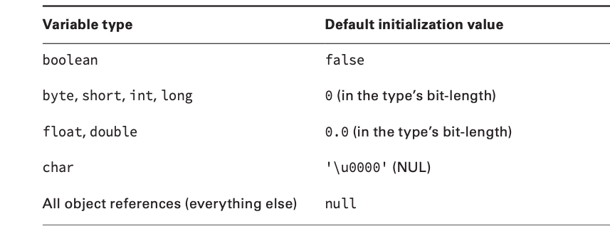
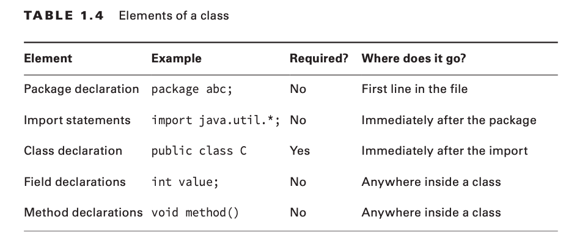

# Order of Initialization
- Fields and instance initializer blocks are run in the order in which they appear in the file.
- The constructor runs after all fields and instance initializer blocks have run.

# Primitive Types and Size

```
/* 
	Does not compile because we represent double value which cannot fit into float
*/
private float value = 14.0;

/* 
	Does compile because we indicate it as float using character f at the end
*/
private float value = 14.0f;

/* 
	Does compile because we forcibly casting double to float
*/
private float value = (float) 14.0;

/*
	Does compile because compiler adds the decimal automatically
*/
private float value = 14;

/*
	Does compile because float can fit in double value
*/
private double value = 14.0f;

/*
	Does not compile because we represent long value which cannot fit into int
*/
private int value = 2L;

/*
	Does compile because we forcibly casting long to int
*/
private int value = (int) 2L;

/*
	Does compile because int value can be stored in long
*/
private long value = 2;
```
# Numeric Literals
- You can add underscores anywhere except at the beginning of a literal, the end of a literal, right before a decimal point, or right after a decimal point.

# Reference Types
A value is assigned to a reference in one of two ways:
- A reference can be assigned to another object of the same type.
- A reference can be assigned to a new object using the new keyword.

# Difference between Primitive and Reference Type.
- Reference types can be assigned null, which means they do not currently refer to an object. Primitive types will give you a compiler error if you attempt to assign them null.
- Reference types can be used to call methods when they do not point to null. Primitives do not have methods declared on them.
- Primitive types are in lowercase letters. Reference types are in UpperCamelCase letters.

# Default Initialization Values for Instance Variables


# Elements Order in Class

- Also, a file can contain any number of classes but atmost one class can be public. If public class is present then file name should match class name.

# Garbage Collection
- It is a process to reclaim memory of objects that are no longer reachable in heap.
- A object is considered no longer reachable when any one of the following occurs:
	- The object no longer has any references pointing to it.
	- All references to the object have gone out of scope.
- We can use System.gc() method to manually run garbage collection but it is not guaranteed to run i.e Java has full control over it.
- finalize() method runs zero or one time. It is called only during Garbage collection. Even if the object is not garbage collection in the first attempt, the finalize() method would not be called during second attempt.