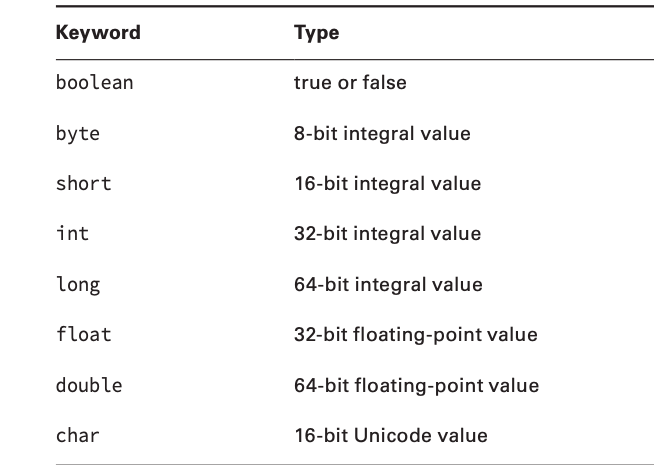

# Order of Initialization
- Fields and instance initializer blocks are run in the order in which they appear in the file.
- The constructor runs after all fields and instance initializer blocks have run.

# Primitive Types and Size

# Numeric Literals
- You can add underscores anywhere except at the beginning of a literal, the end of a literal, right before a decimal point, or right after a decimal point.