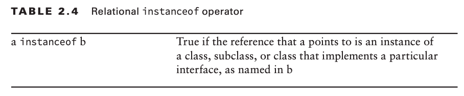
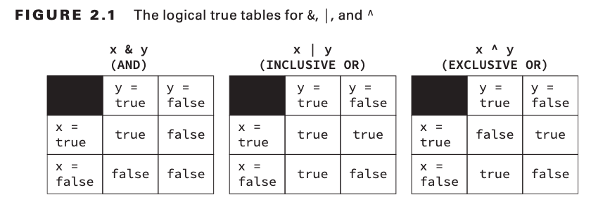

# Order of Operater Precedence


# Modulus Operator
- For a given divisor y (+ve or -ve) and positive dividend, the result produced is between 0 and (y - 1).
- For a given divisor y (+ve or -ve) and negative dividend, the result produced is between (-y + 1) and 0.

# Numeric Promotion Rules
- If two values have different data types, Java will automatically promote one of the values to the larger of the two data types.
- If one of the values is integral and the other is floating-point, Java will automatically promote the integral value to the floating-point value’s data type.
- Smaller data types, namely byte, short, and char, are first promoted to int any time they’re used with a Java binary arithmetic operator, even if neither of the operands is int.
- After all promotion has occurred and the operands have the same data type, the result- ing value will have the same data type as its promoted operands.

# Java Unary Operator

- In Java 1 and true are not related in any way, just as 0 and false are not related.
- Hence we cannot apply logical operator on numeric value and numeric operator on logical values.

# Compound Assignment Operators
- The left-hand side of the compound operator can only be applied to a variable that is already defined and cannot be used to declare a new variable. Otherwise it would fail to compile.
- Compound operators are useful for more than just shorthand—they can also save us from having to explicitly cast a value.
```
long x = 10;
int y = 3;
y = y * x; // Does not compile
y *= x; // Does compile
```

# Relational Operator - instanceof


# Logical Operators


# Short Circuit Operators
- The short-circuit operators are nearly identical to the logical operators, & and |, respectively, except that the right-hand side of the expression may never be evaluated if the final result can be determined by the left-hand side of the expression.
- A most common use case for short-circuit operators is used for null checking an object before performing an operation.

